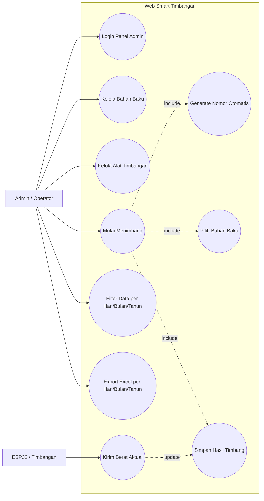
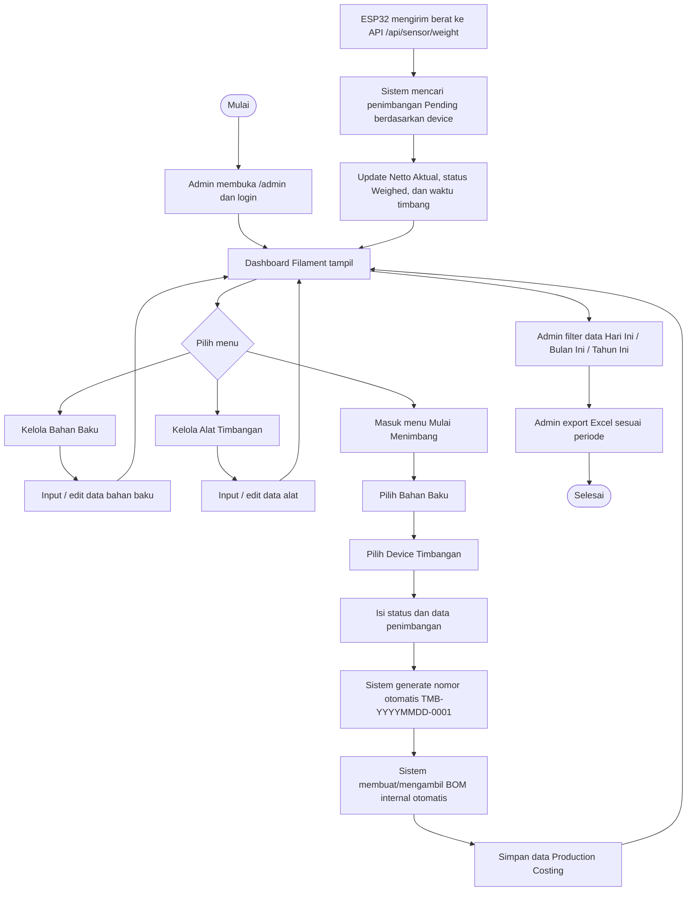
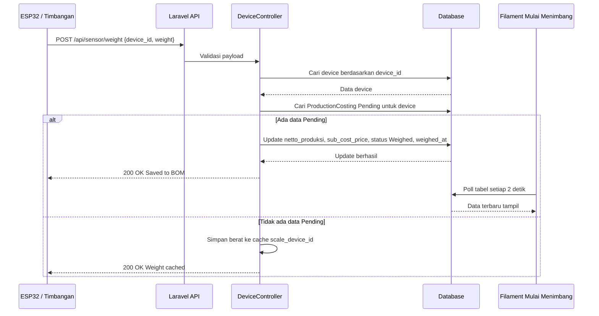
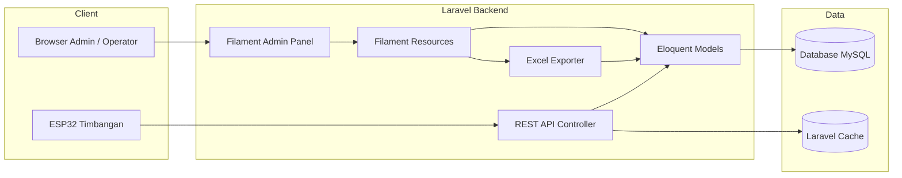
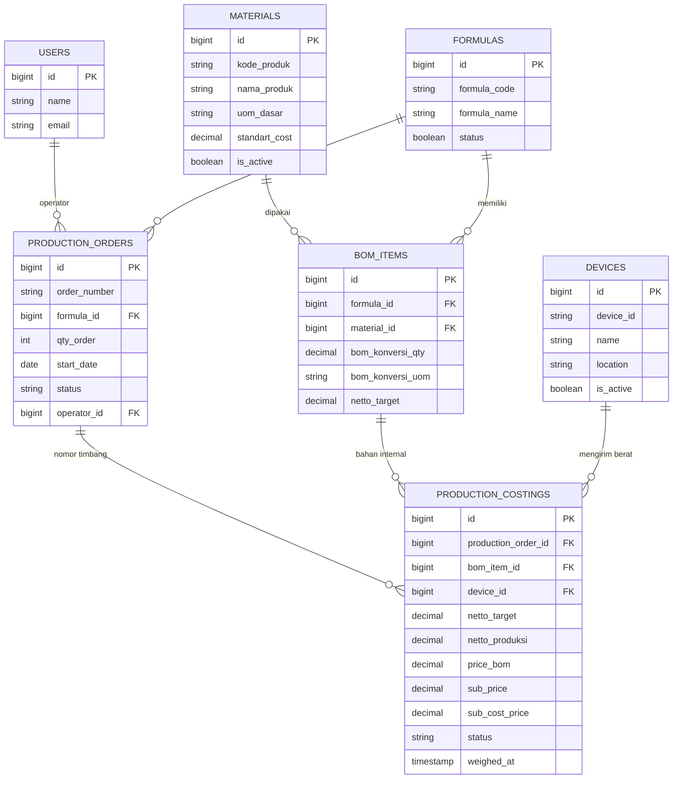
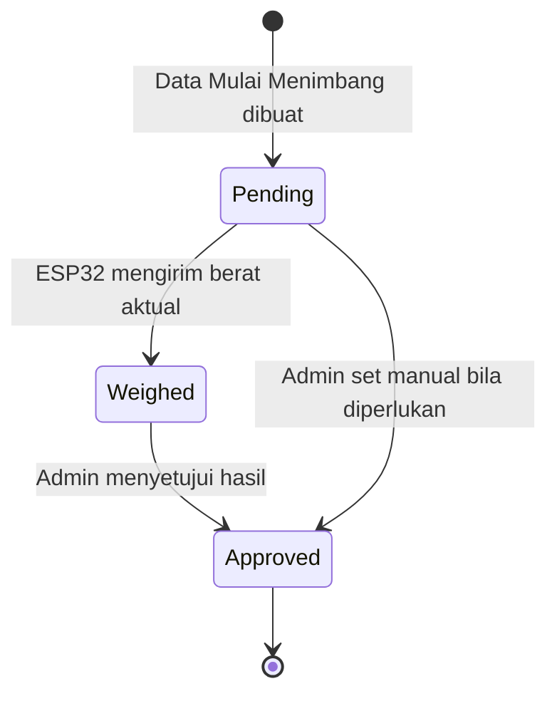

# Diagram UML Alur Web Smart Timbangan

Dokumen ini menggambarkan alur web terbaru pada aplikasi Smart Timbangan berbasis Laravel 11 dan Filament. Alur saat ini memakai menu `Bahan Baku` sebagai master data utama, lalu menu `Mulai Menimbang` membuat nomor penimbangan otomatis dan menghubungkan bahan baku ke data penimbangan.

---

## 1. Use Case Diagram



---

## 2. Activity Diagram Alur Web



---

## 3. Sequence Diagram Membuat Data Mulai Menimbang

```mermaid
sequenceDiagram
    actor Admin as Admin / Operator
    participant UI as Filament Panel
    participant PC as ProductionCostingResource
    participant Create as CreateProductionCosting
    participant DB as Database

    Admin->>UI: Buka menu Mulai Menimbang
    UI->>PC: Render form create
    PC->>DB: Ambil daftar Material aktif
    DB-->>PC: Data Bahan Baku
    PC-->>UI: Tampilkan pilihan Bahan Baku dan Device

    Admin->>UI: Pilih Bahan Baku, Device, Status
    Admin->>UI: Klik Create
    UI->>Create: Kirim data form

    Create->>DB: Ambil Material berdasarkan material_id
    Create->>DB: Cari / buat Formula Default internal
    Create->>DB: Cari / buat BOM Item internal
    Create->>Create: Generate nomor TMB-YYYYMMDD-0001
    Create->>DB: Buat Production Order otomatis
    Create->>DB: Simpan Production Costing
    DB-->>Create: Data tersimpan
    Create-->>UI: Redirect ke daftar Mulai Menimbang
```

---

## 4. Sequence Diagram Update Berat dari Timbangan



---

## 5. Component Diagram



---

## 6. ERD Sederhana



---

## 7. State Diagram Status Penimbangan


