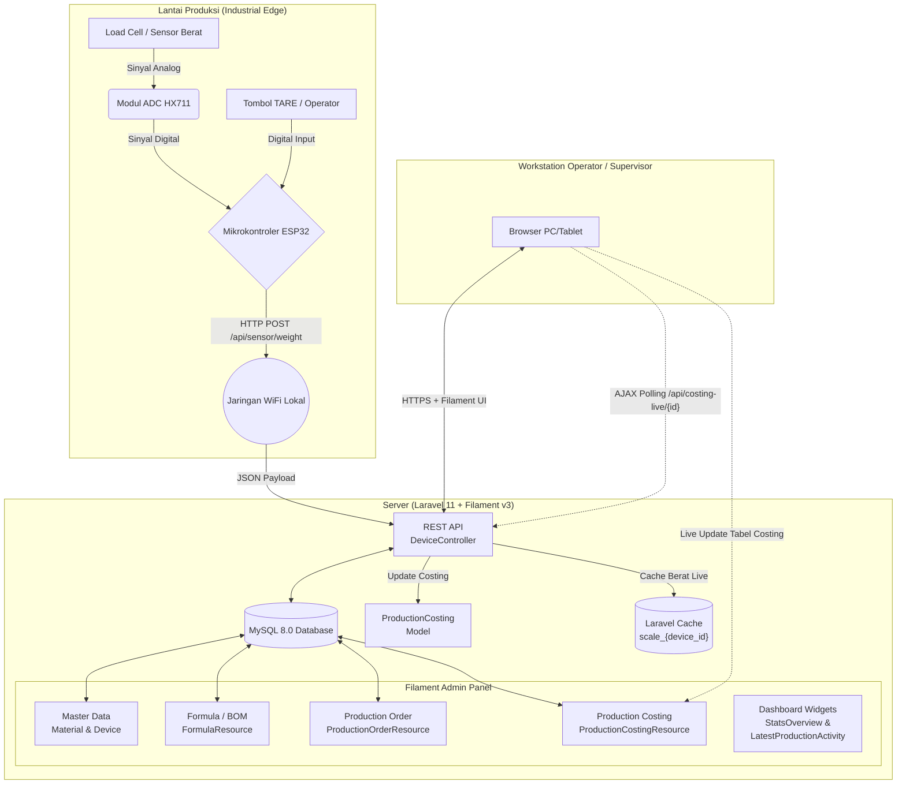
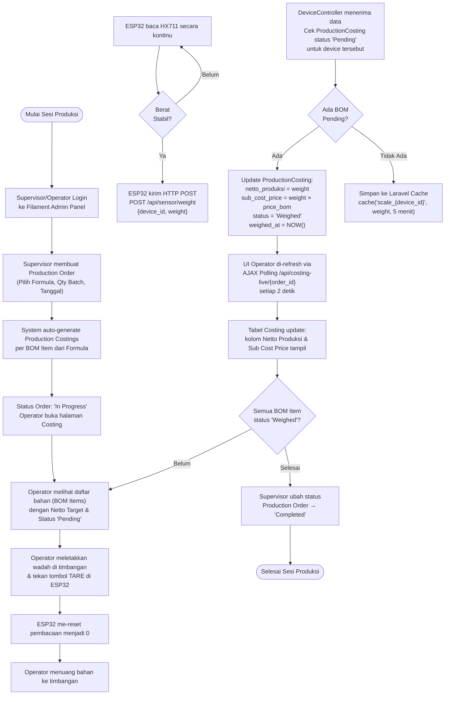
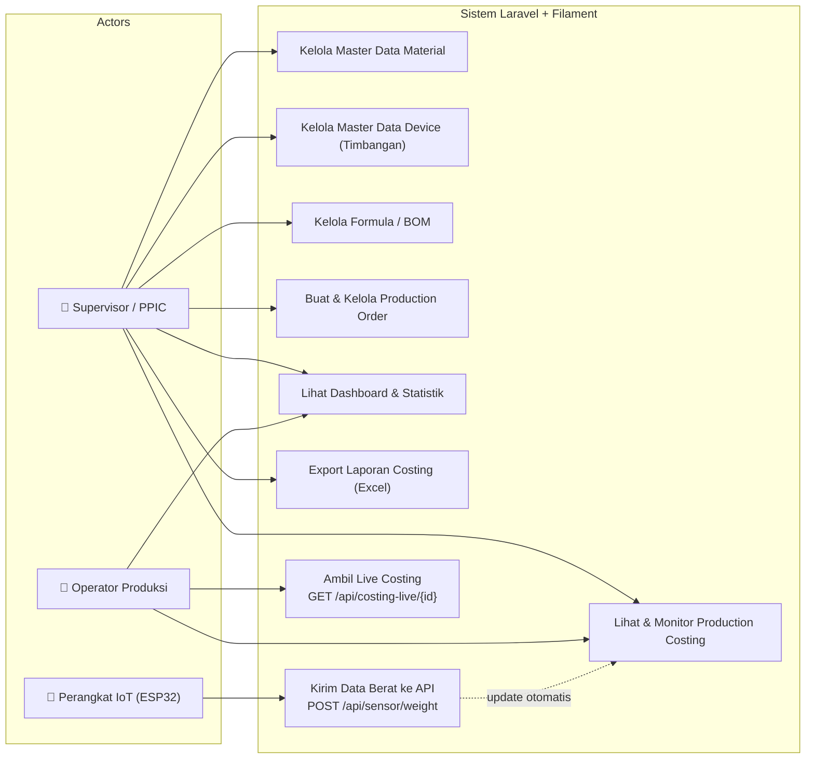
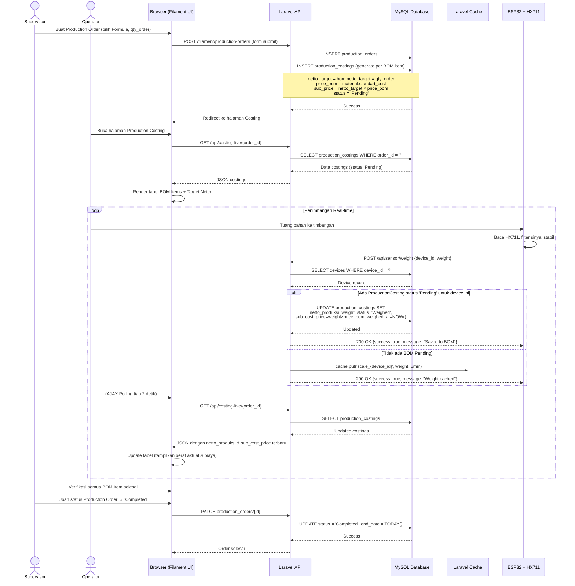
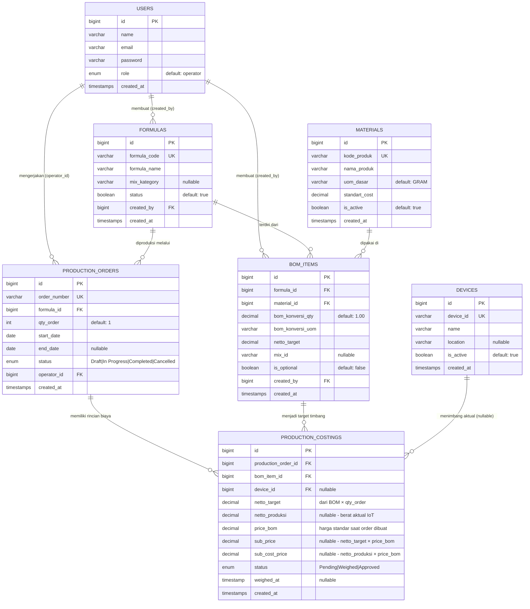
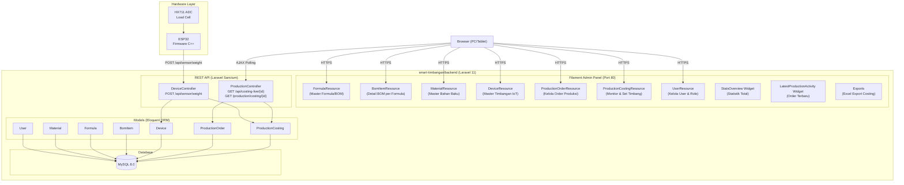
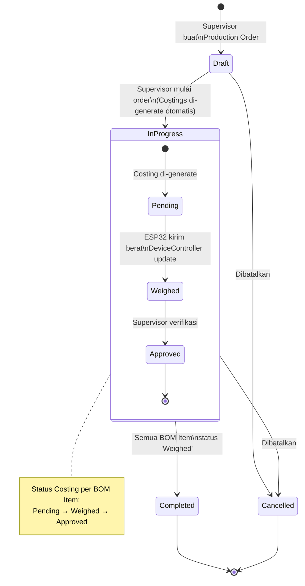

# Kumpulan Diagram UML & Flowchart
**Sistem Timbangan Industrial IoT untuk Bill of Materials (BOM) Produksi**

Dokumen ini berisi arsitektur sistem terkini berdasarkan implementasi aktual. ESP32 berkomunikasi langsung dengan Laravel 11 (Filament v3) untuk memproses penimbangan *Batching* sesuai resep/formula BOM. Stack: **Laravel 11 + Filament v3 + MySQL + Laravel Sanctum + ESP32 (HX711)**.

---

## 1. 🏗️ Arsitektur Sistem (Deployment Diagram)

---

## 2. 🚶‍♂️ Flowchart Sistem (Alur Penimbangan BOM)

---

## 3. 🧑‍🤝‍🧑 Use Case Diagram

---

## 4. ⏱️ Sequence Diagram (Alur Penimbangan Aktual)

---

## 5. 🗄️ Entity Relationship Diagram (ERD)

---

## 6. 📦 Struktur Komponen (Component Diagram)

---

## 7. 🔄 State Diagram (Siklus Hidup Production Order & Costing)

