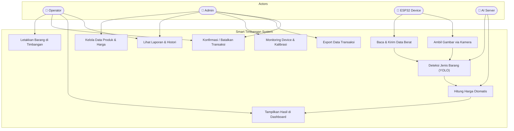
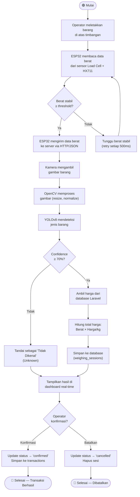
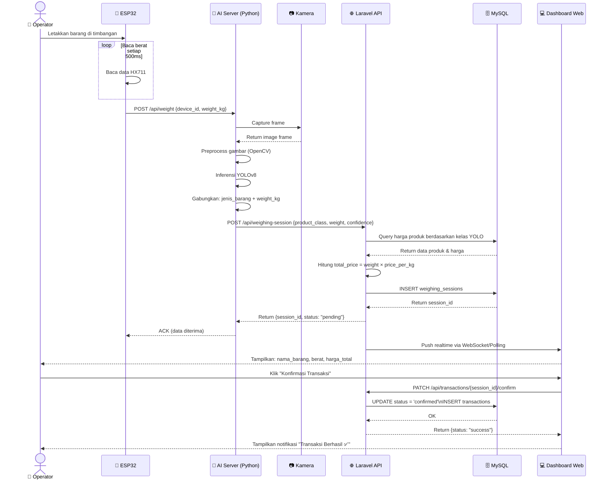
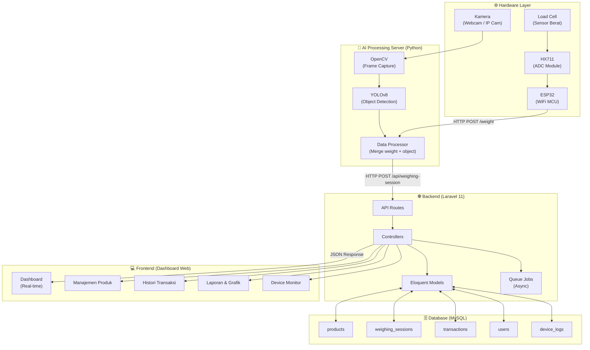
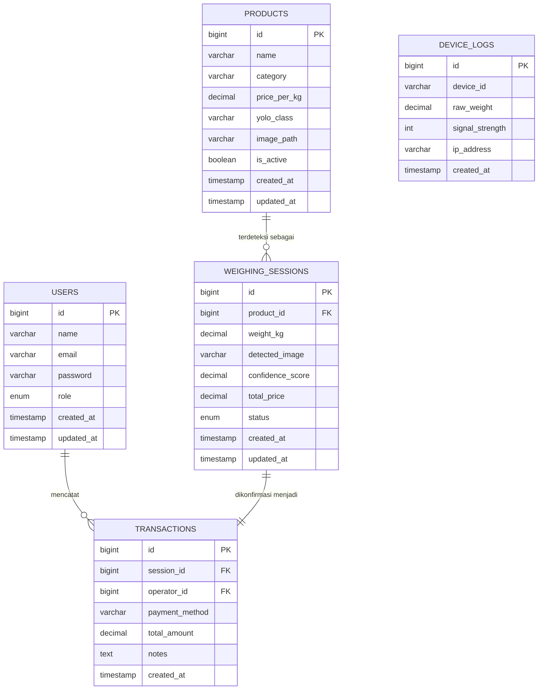
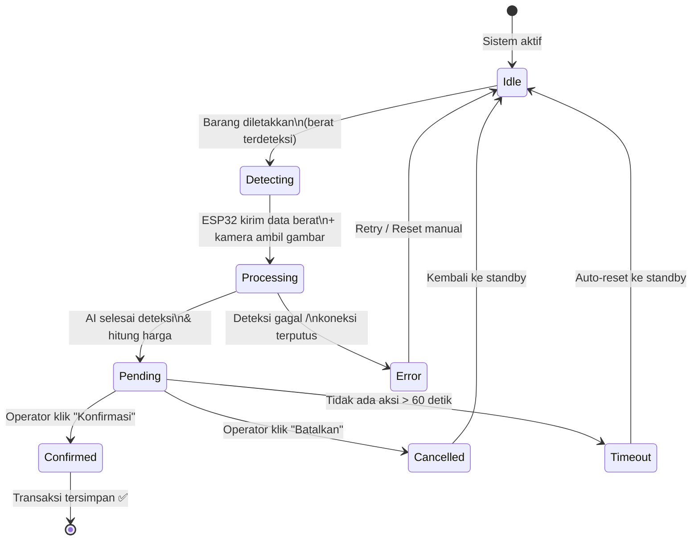
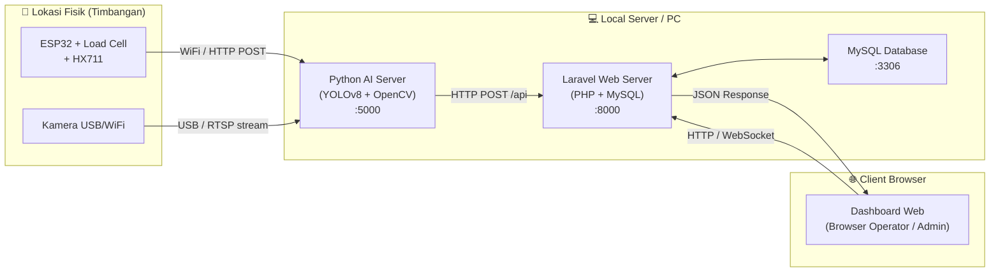
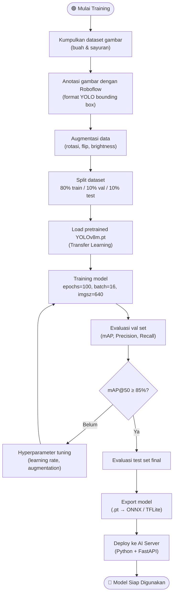

# 📊 Diagram UML & Flowchart
## Smart Timbangan Otomatis — Berbasis IoT + Computer Vision

---

## 1. 🎭 Use Case Diagram

---

## 2. 🔄 Activity Diagram — Alur Utama Sistem

---

## 3. 📡 Sequence Diagram — Interaksi Antar Komponen

---

## 4. 🏗️ Component Diagram — Arsitektur Sistem

---

## 5. 🗄️ Entity Relationship Diagram (ERD)

---

## 6. 🔁 State Diagram — Status Sesi Penimbangan

---

## 7. 📶 Deployment Diagram — Topologi Jaringan

---

## 8. 🔧 Flowchart Training Model YOLOv8

---

## 📌 Ringkasan Komponen Sistem

| Layer | Komponen | Teknologi | Peran |
|---|---|---|---|
| **Hardware** | Sensor berat | Load Cell + HX711 | Membaca berat barang |
| **Hardware** | Mikrokontroler | ESP32 | Kirim data via WiFi |
| **Hardware** | Visual input | Kamera USB/IP | Ambil gambar barang |
| **AI Server** | Object Detection | YOLOv8 + OpenCV | Identifikasi jenis barang |
| **AI Server** | Data Processor | Python + FastAPI | Gabungkan data & kirim ke API |
| **Backend** | REST API | Laravel 11 | Manajemen data & bisnis logic |
| **Database** | Storage | MySQL 8.0 | Simpan semua data transaksi |
| **Frontend** | Dashboard | Laravel Blade/Vue | Visualisasi real-time |
